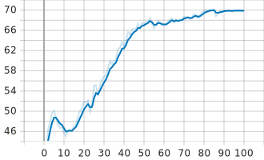
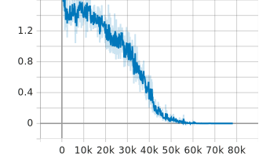
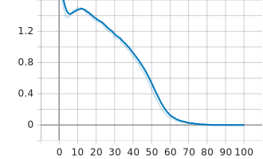

# Vision Transformer (ViT) PyTorch 复现与训练

本项目是一个基于 PyTorch 从零构建并训练 Vision Transformer (ViT) 的精简实现。
基于2020年的论文《An Image is Worth 16x16 Words: Transformers for Image Recognition at Scale》

## 环境依赖
* Python >= 3.8
* PyTorch >= 2.0
* torchvision
* tqdm
* tensorboard

## 数据集
本项目默认使用 **CIFAR-10** 数据集。

## 训练结果
lr=5e-4 batch_size=64 epochs=100

  <b>准确率曲线</b> 
  

<table align="center">
  <tr>
    <td align="center"><b>训练损失 (Loss per Batch)</b></td>
    <td align="center"><b>训练损失 (Loss per Epoch)</b></td>
  </tr>
  <tr>
    <td></td>
    <td></td>
  </tr>
</table>

